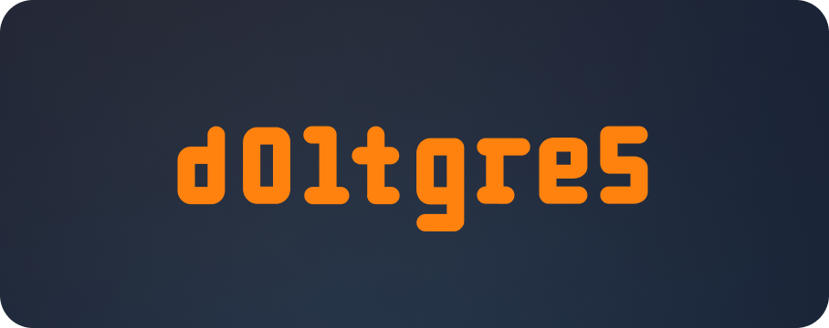

DoltgreSQL is a Postgres-compatible version of Dolt. It is currently in pre-alpha release and has
many gaps that need to be addressed before being used in production.

Download the latest DoltgreSQL
[here](https://github.com/dolthub/doltgresql/releases/latest).

## For DoltgreSQL documentation visit the [Doltgres docs site](https://doltgres.com/docs).
