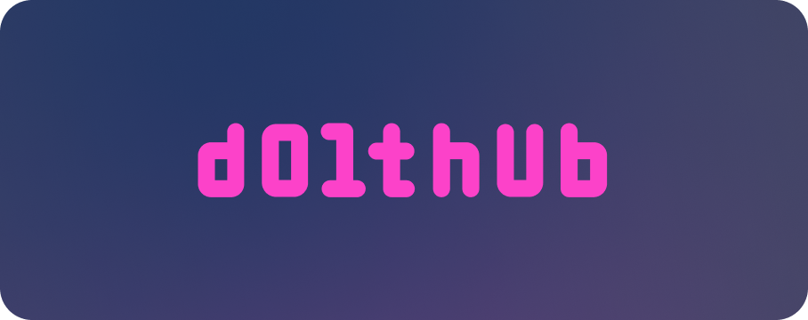

[DoltHub](https://www.dolthub.com) is a place to share Dolt databases. We host public data for free! DoltHub adds a modern, secure, always on database management web GUI to the Dolt ecosystem. Edit your database on the web, have another person review it via a pull request, and have the production database pull it to deploy.

DoltHub is GitHub for Dolt. DoltHub acts as a [Dolt remote](/concepts/dolt/git/remotes) you can [clone, push, pull and fetch](/cli-reference/cli) from. DoltHub adds [permissions](/concepts/dolthub/permissions), [pull requests](/concepts/dolthub/prs), [issues](/concepts/dolthub/issues), and [forks](/concepts/dolthub/forks) to the Dolt ecosystem. Additionally, DoltHub has a modern SQL workbench built in so you can explore and change databases on the web.

## Getting Started

DoltHub has many uses. We recommend getting started by [sharing a database](/products/dolthub/data-sharing).

[Data Sharing](/products/dolthub/data-sharing)

This documentation will walk you through discovering data on DoltHub, cloning a copy locally, making a change on a fork, and submitting a pull request to the original database.

## DoltHub API

DoltHub has [an API](/products/dolthub/api/) you can script against. The documentation covers:

1. [Authentication](/products/dolthub/api/authentication)
2. [SQL API](/products/dolthub/api/sql) - Used to make read or write SQL queries to a DoltHub database
3. [CSV API](/products/dolthub/api/csv) - Used to download CSV format files of DoltHub tables
4. [Database API](/products/dolthub/api/database) - Used to interact with DoltHub databases and pull requests
5. [Hooks](/products/dolthub/api/hooks) - Used to receive change events to your DoltHub databases

## Guides

- [Transform File Uploads](/products/dolthub/transform-uploads)

We added a feature to [Transform DoltHub File Uploads](/products/dolthub/transform-uploads). This allows you to set up an API to receive and transform files that are uploaded to your databases on DoltHub. The transformed files are sent back to DoltHub for import to a DoltHub database.

- [Workspaces](/products/dolthub/workspaces)

We added the workspaces concept to DoltHub as a staging area for changes made from the
web. Learn what workspaces are and how to use them most effectively.

- [Continuous Integration](/products/dolthub/continuous-integration/)

DoltHub and DoltLab support continuous integration (CI) testing which allow you to validate changes before you commit them on your primary branch. Learn how to configure and run CI on your DoltHub and DoltLab databases.
