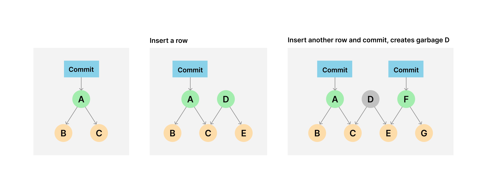

# How garbage is created

Doltgres creates on disk garbage. Doltgres transactions that do not have a corresponding Doltgres commit create on disk garbage. This garbage is most noticeable after large data imports.

Specifically, writes to Doltgres can result in multiple chunks of the [prolly
tree](https://www.dolthub.com/blog/2020-04-01-how-dolt-stores-table-data) being rewritten,
which [writes a large portion of the
tree](https://www.dolthub.com/blog/2020-05-13-dolt-commit-graph-and-structural-sharing/#cant_share).
When you perform write operations without committing or delete a branch containing novel
chunks, garbage is created.

## Online

You can run garbage collection on your running SQL server using [`select
dolt_gc`](/reference/version-control/dolt-sql-functions#dolt_gc) through any connected client.

NOTE: Performing GC on [a cluster replica](/reference/server/replication) which is in standby mode is not
yet supported, and running `select dolt_gc()` on the replica will fail.

# Automated GC

Automated garbage collection is currently experimental and will be enabled by default in a release
later this year. Check back for details.
