# Basic Administrator Guide

This guide will cover how to perform common DoltLab administrator configuration and tasks for the latest versions of DoltLab, >= `v2.1.0`. These versions use the [installer](/reference/installer) binary included in DoltLab's `.zip` file. For instructions on running DoltLab in Enterprise mode and configuring exclusive Enterprise features, see the [Enterprise Guide](/guides/enterprise). If you're using an older version of DoltLab that does not include the [installer](/reference/installer), please see the [pre-installer Admin guide](/older/pre-installer-administrator-guide).

> Note: If you selected the Podman runtime (`--runtime=podman` flag or `runtime: podman` in `installer_config.yaml`), substitute `docker` with `podman` and `docker-compose` with `podman-compose` in the commands below. Container names may use hyphens instead of underscores (e.g., `doltlab-doltlabapi-1`).

1. [File issues and view release notes](#file-issues-and-view-release-notes)
2. [Backup DoltLab data](#backup-and-restore-volumes)
3. [Connect with the DoltLab team](#connect-with-the-doltlab-team)
4. [View DoltLab service logs](#view-doltlab-service-logs)
5. [Send service logs to DoltLab team](#send-service-logs-to-doltlab-team)
6. [Authenticate a Dolt client to use a DoltLab account](#authenticate-a-dolt-client-to-use-a-doltlab-account)
7. [Monitor DoltLab with cAdvisor and Prometheus](#monitor-doltlab-with-cadvisor-and-prometheus)
8. [Prevent unauthorized user account creation](#prevent-unauthorized-user-account-creation)
9. [Use an external database server with DoltLab](#use-an-external-database-server-with-doltlab)
10. [DoltLab Jobs](#doltlab-jobs)
11. [Disable usage metrics](#disable-usage-metrics)
12. [Use a domain name with DoltLab](#use-a-domain-name-with-doltlab)
13. [Run DoltLab on Hosted Dolt](#run-doltlab-on-hosted-dolt)
14. [Improve DoltLab performance](#improve-doltlab-performance)
15. [Serve DoltLab behind an AWS Network Load Balancer](#serve-doltlab-behind-an-aws-network-load-balancer)
16. [Update database passwords](#update-application-database-passwords)
17. [Run DoltLab with no egress access](#run-doltlab-with-no-egress-access)
18. [Reset a user's password](#reset-a-users-password)
19. [Reset password attempts for a user](#reset-password-attempts-for-a-user)
20. [Change `doltlabdb` Server Configuration](#change-doltlabdb-server-configuration)
21. [Troubleshoot common issues](#troubleshoot-common-issues)
22. [Run DoltLab with Podman](#run-doltlab-with-podman)

## File issues and view release notes

DoltLab's source code is currently closed, but you can file DoltLab issues the [issues repository](https://github.com/dolthub/doltlab-issues). Release notes are available [here](/reference/release-notes/).

## Backup and restore volumes

DoltLab currently persists all data to local disk using Docker volumes. To backup or restore DoltLab's data, we recommend the following steps which follow Docker's official [volume backup and restore documentation](https://docs.docker.com/storage/volumes/#back-up-restore-or-migrate-data-volumes).

## Backing up and restoring remote data, user uploaded data, and Dolt server data with Docker

To backup DoltLab's remote data, the database data for all database on a given DoltLab instance, leave DoltLab's services up and run:

```bash
# backup remote data stored in DoltLab RemoteAPI's volume and save to a tar file
docker run --rm --volumes-from doltlab_doltlabremoteapi_1 -v $(pwd):/backup ubuntu tar cvf /backup/remote-data.tar /doltlab-remote-storage
```

This will create a tar file called `remote-data.tar` in your working directory.

To backup user uploaded files, run:

```bash
# backup remote data stored in DoltLab RemoteAPI's volume and save to a tar file
docker run --rm --volumes-from doltlab_doltlabfileserviceapi_1 -v $(pwd):/backup ubuntu tar cvf /backup/user-uploaded-data.tar /doltlab-user-uploads
```

This will create a tar file called `user-uploaded-data.tar` in your working directory.

To backup Dolt server data, run:

```bash
# backup Dolt's root volume
docker run --rm --volumes-from doltlab_doltlabdb_1 -v $(pwd):/backup ubuntu tar cvf /backup/doltlabdb-root.tar /.dolt

# backup Dolt's config volume
# This volume has been removed in DoltLab >= v2.3.12
docker run --rm --volumes-from doltlab_doltlabdb_1 -v $(pwd):/backup ubuntu tar cvf /backup/doltlabdb-configs.tar /etc/dolt

# backup Dolt's data volume
docker run --rm --volumes-from doltlab_doltlabdb_1 -v $(pwd):/backup ubuntu tar cvf /backup/doltlabdb-data.tar /var/lib/dolt

# backup Dolt's local backup volume
docker run --rm --volumes-from doltlab_doltlabdb_1 -v $(pwd):/backup ubuntu tar cvf /backup/doltlabdb-backups.tar /backups
```

Before restoring DoltLab's volumes from a backup, first, stop the running DoltLab services, `prune` the Docker containers, and remove the old volume(s):

```bash
cd doltlab

# stop the DoltLab services
docker-compose stop

# prune containers
docker container prune

# remove the remote data volume
docker volume rm doltlab_doltlab-remote-storage

# remove the user uploaded data
docker volume rm doltlab_doltlab-user-uploads

# remove the Dolt server root volume
docker volume rm doltlab_doltlabdb-dolt-root

# remove the Dolt server config volume
# This volume has been removed in DoltLab >= v2.3.12
docker volume rm doltlab_doltlabdb-dolt-configs

# remove the Dolt server data volume
docker volume rm doltlab_doltlabdb-dolt-data

# remove the Dolt server local backups volume
docker volume rm doltlab_doltlabdb-dolt-backups
```

Next, [start DoltLab's services](/guides/installation/start-doltlab) using the `start.sh` script. After the script completes, stop DoltLab once more with `./stop.sh`. Doing this will recreate the required containers so that their volumes can be updated with the commands below.

Once the services are stopped, `cd` into the directory containing the `remote-data.tar` backup file and run:

```bash
# restore remote data from tar
docker run --rm --volumes-from doltlab_doltlabremoteapi_1 -v $(pwd):/backup ubuntu bash -c "cd /doltlab-remote-storage && tar xvf /backup/remote-data.tar --strip 1"
```

To restore user uploaded data, `cd` into the directory containing `user-uploaded-data.tar` and run:

```bash
# restore remote data from tar
docker run --rm --volumes-from doltlab_doltlabfileserviceapi_1 -v $(pwd):/backup ubuntu bash -c "cd /doltlab-user-uploads && tar xvf /backup/user-uploaded-data.tar --strip 1"
```

To restore Dolt server root data, `cd` into the directory containing `doltlabdb-root.tar` and run:

```bash
# restore Dolt server root data from tar
docker run --rm --volumes-from doltlab_doltlabdb_1 -v $(pwd):/backup ubuntu bash -c "cd /.dolt && tar xvf /backup/doltlabdb-root.tar --strip 1"
```

To restore Dolt server config data, `cd` into the directory containing `doltlabdb-configs.tar` and run:

```bash
# restore Dolt server config data from tar
docker run --rm --volumes-from doltlab_doltlabdb_1 -v $(pwd):/backup ubuntu bash -c "cd /etc/dolt && tar xvf /backup/doltlabdb-configs.tar --strip 2"
```

To restore Dolt server data, `cd` into the directory containing `doltlabdb-data.tar` and run:

```bash
# restore Dolt server data from tar
docker run --rm --volumes-from doltlab_doltlabdb_1 -v $(pwd):/backup ubuntu bash -c "cd /var/lib/dolt && tar xvf /backup/doltlabdb-data.tar --strip 3"
```

To restore Dolt server local backup data, `cd` into the directory containing `doltlabdb-backups.tar` and run:

```bash
# restore Dolt server local backups data from tar
docker run --rm --volumes-from doltlab_doltlabdb_1 -v $(pwd):/backup ubuntu bash -c "cd /backups && tar xvf /backup/doltlabdb-backups.tar --strip 1"
```

You can now restart DoltLab, and should see all data restored from the `tar` files.

## Backing up and restoring the Dolt Server using the `dolt backup` command

The quickest way to do this is with the `./doltlabdb/shell-db.sh` script generated by the [installer](/reference/installer):

```bash
DOLT_PASSWORD=<DOLT_PASSWORD> ./doltlabdb/shell-db.sh
...
mysql>
```

Next, add a local backup using the `DOLT_BACKUP()` stored procedure. By default, DoltLab uses a Docker volume backed by the host's disk that allows you to create backups of the Dolt server. These backups will be located at `/backups` from within the Dolt server container. To create persistent backups, simply use `/backups` as the path prefix to the backup names:

```bash
mysql> call dolt_backup('add', 'local-backup', 'file:///backups/dolthubapi/2023/06/01');
+---------+
| success |
+---------+
|       1 |
+---------+
1 row in set (0.00 sec)
```

The above snippet will create a new backup stored at `/backups/dolthubapi/2023/06/01` within the Dolt server container, and persisted to the host using the Docker volume `doltlab_doltlabdb-dolt-backups`.

You can sync the backup with the `sync` command:

```bash
mysql> call dolt_backup('sync', 'local-backup');
+---------+
| success |
+---------+
|       1 |
+---------+
1 row in set (0.00 sec)
```

The local backup is now synced, and you can now disconnect the shell.

At the time of this writing, Dolt only supports restoring backups using the CLI. To restore the Dolt server from a local backup, stop DoltLab's services using `./stop.sh`.

Then, use the `./doltlabdb/dolt_db_cli.sh` generated by the [installer](/reference/installer). This script will open a container shell with access to the Dolt server volumes.

Delete the existing `./dolthubapi` directory located at `/var/lib/dolt` from within this container:

```bash
./doltlabdb/dolt_db_cli.sh
root:/var/lib/dolt# ls
dolthubapi
root:/var/lib/dolt# rm -rf dolthubapi/
```

Doing this removes the existing Dolt server database. Now, use [dolt backup restore](https://docs.dolthub.com/cli-reference/cli#dolt-backup) to restore the database from the backup located at `/backups/dolthubapi/2023/06/01`:

```bash
root:/var/lib/dolt# dolt backup restore file:///backups/dolthubapi/2023/06/01 dolthubapi

root:/var/lib/dolt# ls
dolthubapi
```

The database has now been successfully restored, and you can now restart DoltLab.

## Connect with the DoltLab Team

If you need to connect to a DoltLab team member, the best way to do so is on [Discord](https://discord.gg/s8uVgc3), in the `#doltlab` server.

## View DoltLab Service Logs

DoltLab is composed of [multiple services](https://www.dolthub.com/blog/2022-02-25-doltlab-101-services-and-roadmap/) running in a single container network via Compose. The container engine writes the logs of each DoltLab service to an internal location. Logs for a particular service can be viewed using the engine's logs command. For example, to view logs of `doltlabapi` service, run:

```bash
docker logs doltlab_doltlabapi_1
```

Podman equivalent:
```bash
podman logs doltlab-doltlabapi-1
```

You can find the location where the engine writes a service's logs by inspecting the `LogPath` of the service.

```bash
docker inspect --format='{{.LogPath}}' doltlab_doltlabapi_1
```

Podman equivalent:
```bash
podman inspect --format='{{.LogPath}}' doltlab-doltlabapi-1
```

## Data logged by DoltLab Services

Below is a list of data logged by DoltLab's various services. As of DoltLab v2.3.10 DoltLab's logging is not configurable via the installer, but
this may change.

### doltlabdb

This is DoltLab's application Dolt server.
DoltLab runs the server at `log-level=debug`, which writes full database queries to the server logs. The logs at this level contain sensitive information, including insert statements executed against the server, session information, and end-user information. These logs should not be shared with third parties. 

### doltlabremoteapi

DoltLab's Remote API gRPC service manages access to remote data. This service uses gRPC middleware to log the following information
on all ingress requests:

- gRPC Method
- gRPC Code
- Tracing Request ID
- User Agent
- Panic stack if one occurs.

The Remote API service itself logs the following:

- Data conflicts if detected.
- S3 Bucket names (If AWS Cloud backed storage is configured).
- S3 Object Keys (If AWS Cloud backed storage is configured).
- File size and S3 UploadPart numbers (If AWS Cloud backed storage is configured).
- DoltLab usernames, display names, and email addresses.
- Internal deployment IDs.
- Internal repository IDs.
- Hashes of downloaded chunks.
- Upload URL where chunks will be uploaded.
- Repository token root hash.
- Commit hashes.

DoltLab's Remote API also runs a background process that serves repository data on a different port, but
writes logs to Stdout of `doltlabremoteapi`. This is an HTTP service and it logs the following information
for all ingress requests:

- Http method
- Http URL
- Request timing information

### doltlabapi

DoltLab's Main API, which is a gRPC service. This service uses gRPC middleware to log the following information
on all ingress requests:

- gRPC Method
- gRPC Code
- Tracing Request ID
- User Agent
- Panic stack if one occurs.

DoltLab API itself logs the following:

- Third party errors from [LicenseSpring](https://licensespring.com/) golang SDK in DoltLab Enterprise.
- The number of request headers and token prefix used on ingress repository authentication requests.
- The [DBR](https://github.com/dolthub/dbr) event name of database errors, i.e. `dbr.begin.error`.
- The username of the default DoltLab user, often `admin`.
- Internal end-user session IDs.
- Internal end-user API token IDs.
- Internal webhook IDs.
- Database table column tag names, during some errors.
- The full logs of any DoltLab Job that resulted in an error. Because DoltLab Jobs are cleaned up after they complete, destroying the logs,
the logs, in the event of a failure, are written to the DoltLab API logs so they are persisted for debugging.

### Jobs

DoltLab currently supports four jobs, "file import," "pull request merge," "large query," and "continuous integration" jobs.
Each of these Jobs runs outside the main DoltLab API process.
These Job run Dolt binaries in order to perform tasks and their logs contain the following information:

- Dolt CLI Stderr output if the command has written to stderr.
- Repository owner.
- Repository owner email address (pull request merge Job, large query Job).
- Repository name.
- Repository branches (only those relevant to the Job's task).
- Internal operation IDs.
- AWS SDK errors (if AWS cloud backed storage is configured).
- S3 Bucket names (if AWS cloud backed storage is configured).
- S3 Object Keys (if AWS cloud backed storage is configured).
- Internal user IDs.
- Repository commits (only those relevant to the Job's task).
- Key/path of a file stored by `doltlabfileserviceapi` (file import Job).
- Repository table name (file import Job).
- Original uploaded file name (file import Job).
- Pull request merge commit message (pull request merge Job).
- Repository query (large query Job).
- `dolt sql-server` logs at the default log-level (continuous integration Job).
- Saved query name (continuous integration Job).
- Saved query value (continuous integration Job).

### doltlabfileserviceapi

DoltLab File Service API manages user upload files when cloud backed storage is not configured. This is an HTTP service, and it logs the following information
for all ingress requests:

- Http method
- Http URL
- Request timing information

### doltlabgraphql

DoltLab GraphQL API is the data API for DoltLab's frontend UI. This service only logs errors returned by `doltlabapi`.

### doltlabui

DoltLab UI is a react application. It does not log any information in the server, and only logs a internal "ResourceType" name
in the client on a particular error.

## Send Service Logs to DoltLab Team

If you need to send service logs to the DoltLab team, first locate the logs on the host using the `docker inspect` command, then `cp` the logs to your working directory:

```bash
DOLTLABAPI_LOGS=$(docker inspect --format='{{.LogPath}}' doltlab_doltlabapi_1)
cp "$DOLTLABAPI_LOGS" ./doltlab-api-logs.json
```

Next, change permissions on the copied file to enable reads by running:

```bash
chmod 0644 ./doltlab-api-logs.json
```

Finally, download the copied log file from your DoltLab host using `scp`. You can then send this and any other log files to the DoltLab team member you're working with via email.

## Authenticate a Dolt Client to use a DoltLab account

To authenticate a Dolt client against a DoltLab remote, use the `--auth-endpoint`, `--login-url`, and `--insecure` arguments with the [dolt login](https://docs.dolthub.com/cli-reference/cli#dolt-login) command.

`--auth-endpoint`, should point at the [DoltLab RemoteAPI Server](https://www.dolthub.com/blog/2022-02-25-doltlab-101-services-and-roadmap/#doltlab-remoteapi-server) running on port `50051`.
`--login-url`, should point at the DoltLab instance's credentials page.
`--insecure`, a boolean flag, should be used since if DoltLab is not running with TLS.

```bash
dolt login --insecure --auth-endpoint doltlab.dolthub.com:50051 --login-url http://doltlab.dolthub.com/settings/credentials
```

Running the `dolt login` command will open your browser window to the `--login-url` with credentials populated in the "Public Key" field. Simply add a "Description" and click "Create", then return to your terminal to see your Dolt client successfully authenticated.

```bash
Credentials created successfully.
pub key: 9pg8rrkaqouuno4rihdlkb6pvaf16t134dscb68dlg0u0261rmtg
/.dolt/creds/cepi47m5sojotm8s2e8rkqm9fdjocidsc42canggvb8e0.jwk
Opening a browser to:
	http://doltlab.dolthub.com/settings/credentials#9pg8rrkaqouuno4rihdlkb6pvaf16t134dscb68dlg0u0261rmtg
Please associate your key with your account.
Checking remote server looking for key association.
requesting update
requesting update


Key successfully associated with user: <user> email <email>
```

To authenticate without using the `dolt login` command, first run the [dolt creds new](https://docs.dolthub.com/cli-reference/cli#dolt-creds-new) command, which will output a new public key:

```bash
dolt creds new
Credentials created successfully.
pub key: fef0kj7ia389i5atv8mcb31ksg9h3i6cji7aunm4jea9tccdl2cg
```

Copy the generated public key and run the [dolt creds use](https://docs.dolthub.com/cli-reference/cli#dolt-creds-use) command:

```bash
dolt creds use fef0kj7ia389i5atv8mcb31ksg9h3i6cji7aunm4jea9tccdl2cg
```

Next, login to your DoltLab account, click your profile image, then click "Settings" and then "Credentials".

Paste the public key into the "Public Key" field, write a description in the "Description" field, then click "Create".

Your Dolt client is now authenticated for this DoltLab account.

## Monitor DoltLab with cAdvisor and Prometheus

[Prometheus](https://prometheus.io/) [gRPC](https://grpc.io/) service metrics for [DoltLab's Remote API Server](https://www.dolthub.com/blog/2022-02-25-doltlab-101-services-and-roadmap/#doltlab-remoteapi-server), `doltlabremoteapi`, and [DoltLab's Main API server](https://www.dolthub.com/blog/2022-02-25-doltlab-101-services-and-roadmap/#doltlab-api-server), `doltlabapi`, are published on port `7770`.

The metrics for these services are available at endpoints corresponding to each service's container name. For DoltLab's Remote API, thats `:7770/doltlabremoteapi`, and for DoltLab's Main API that's `:7770/doltlabapi`.

You can view the `doltlabremoteapi` service metrics for our DoltLab demo instance here, [http://doltlab.dolthub.com:7770/doltlabremoteapi](http://doltlab.dolthub.com:7770/doltlabremoteapi) and you can view the `doltlabapi` service metrics here [http://doltlab.dolthub.com:7770/doltlabapi](http://doltlab.dolthub.com:7770/doltlabapi).

To make these endpoints available to Prometheus, open port `7770` on your DoltLab host.

We recommend monitoring DoltLab with [cAdvisor](https://github.com/google/cadvisor), which will expose container resource and performance metrics to Prometheus. Before running `cAdvisor`, open port `8080` on your DoltLab host as well. `cAdvisor` will display DoltLab's running containers via a web UI on `:8080/docker` and will publish Prometheus metrics for DoltLab's container at `:8080/metrics` by default.

Run `cAdvisor` as a Docker container in daemon mode with:

```bash
docker run -d -v /:/rootfs:ro -v /var/run:/var/run:rw -v /sys:/sys:ro -v /var/lib/docker/:/var/lib/docker:ro -v /dev/disk/:/dev/disk:ro -p 8080:8080 --name=cadvisor --privileged gcr.io/cadvisor/cadvisor:v0.39.3
```

To run a Prometheus server on your DoltLab host machine, first open port `9090` on the DoltLab host. Then, write the following `prometheus.yml` file on the host:

```yaml
global:
  scrape_interval: 5s
  evaluation_interval: 10s
scrape_configs:
  - job_name: cadivsor
    static_configs:
      - targets: ["host.docker.internal:8080"]
  - job_name: prometheus
    static_configs:
      - targets: ["localhost:9090"]
  - job_name: doltlabremoteapi
    metrics_path: "/doltlabremoteapi"
    static_configs:
      - targets: ["host.docker.internal:7770"]
  - job_name: doltlabapi
    metrics_path: "/doltlabapi"
    static_configs:
      - targets: ["host.docker.internal:7770"]
```

Then, start the Prometheus server as a Docker container running in daemon mode:

```bash
docker run -d --add-host host.docker.internal:host-gateway --name=prometheus -p 9090:9090 -v "$(pwd)"/prometheus.yml:/etc/prometheus/prometheus.yml:ro prom/prometheus:latest --config.file=/etc/prometheus/prometheus.yml
```

`--add-host host.docker.internal:host-gateway` is only required if you are running the Prometheus server _on_ your DoltLab host. If its running elsewhere, this argument may be omitted, and the `host.docker.internal` hostname in `prometheus.yml` can be changed to the hostname of your DoltLab host.

## Prevent unauthorized user account creation

DoltLab supports explicit email whitelisting to prevent account creation by unauthorized users.

To only permit whitelisted emails to create accounts on your DoltLab instance, edit `./installer_config.yaml` to [configure explicit email whitelisting](#installer-config-whitelist-all-users).

```yaml
# installer_config.yaml
whitelist_all_users: false
```

Save these changes, then rerun the [installer](/reference/installer) to regenerate DoltLab assets that will require explicit whitelisting of new user accounts.

```bash
./installer
```

Alternatively, run the [installer](/reference/installer) with `--whitelist-all-users=false`, which disables automatically whitelisting all users.

Next, once you've restarted you DoltLab instance with the regenerated [installer](/reference/installer) assets, to whitelist an email for account creation in your instance, you will need to insert their email address into the `email_whitelist_elements` table.

To do this run the script generated by the [installer](/reference/installer), called `./doltlabdb/shell-db.sh`.

Use this script by supplying the `DOLT_PASSWORD` you used to start your DoltLab instance. Run:

```bash
DOLT_PASSWORD=<password> ./doltlabdb/shell-db.sh
```

You will see a `mysql>` prompt connected to DoltLab' application Dolt database.

Execute the following `INSERT` to allow the user with `example@address.com` to create an account on your DoltLab instance:

```sql
INSERT INTO email_whitelist_elements (email_address, updated_at, created_at) VALUES ('example@address.com', CURRENT_TIMESTAMP, CURRENT_TIMESTAMP);
```

## Use an external database server with DoltLab

In the external Dolt database, prior to connecting your DoltLab instance, run the following SQL statements:

```sql
CREATE USER 'dolthubadmin' IDENTIFIED BY '<password>';
CREATE USER 'dolthubapi' IDENTIFIED BY '<password>';
GRANT ALL ON *.* TO 'dolthubadmin';
GRANT ALL ON dolthubapi.* TO 'dolthubapi';
```

Next, stop your DoltLab instance if it is running. Then, supply the `--doltlabdb-host=<external db host>` and `--doltlabdb-port=<external db port>` arguments to the [installer](/reference/installer).

When you restart your instance it should now be connected to your external Dolt database.

## DoltLab Jobs

DoltLab Jobs are stand-alone, long-running Docker containers that perform specific tasks for DoltLab users behind the scenes.

As a result, DoltLab may consume additional memory and disk, depending on the number of running Jobs and their workload.

## Disable usage metrics

By default, DoltLab collects first-party metrics for deployed instances. We use DoltLab's metrics to determine how many resources to allocate toward its development and improvement.

Metrics can be disabled by setting the [metrics_disabled](#installer-config-reference-metrics-disabled) field of the `./installer_config.yaml`:

```yaml
# installer_config.yaml
metrics_disabled: true
```

Save these changes, then rerun the [installer](/reference/installer) to regenerate DoltLab assets that disable usage metrics.

```bash
./installer
```

Alternatively, to disable first-party metrics using command line arguments, run the [installer](/reference/installer) with `--disable-usage-metrics=true`.

## Use a domain name with DoltLab

It's common practice to provision a domain name to use for a DoltLab instance. To do so, secure a domain name and map it to the _stable_, public IP address of the DoltLab host. Then, supply the domain name as the value to the `--host` argument used with the [installer](/reference/installer).

Let's say we've have set up and run an EC2 instance with the latest version of DoltLab and have successfully configured its Security Group to allow ingress traffic on `80`, `100`, `4321`, and `50051`. By default, this host will have a public IP address assigned to it, but this IP is unstable and will change whenever the host is restarted.

First, we should attach a stable IP to this host. To do this in AWS, we can provision an [Elastic IP Address (EIP)](https://docs.aws.amazon.com/AWSEC2/latest/UserGuide/elastic-ip-addresses-eip.html#using-instance-addressing-eips-allocating).

Next, we should associate the EIP with our DoltLab host by following [these steps](https://docs.aws.amazon.com/AWSEC2/latest/UserGuide/elastic-ip-addresses-eip.html#using-instance-addressing-eips-associating). Once this is done, the DoltLab host should be reachable by the EIP.

Finally, we can provision a domain name for the DoltLab host through [AWS Route 53](https://docs.aws.amazon.com/Route53/latest/DeveloperGuide/domain-register.html). After registering the new domain name, we need to create an `A` record that's attached to the EIP of the DoltLab host. To do so, follow the steps for creating records outlined [here](https://docs.aws.amazon.com/Route53/latest/DeveloperGuide/resource-record-sets-creating.html).

Your DoltLab host should now be accessible via your new domain name. You can now stop your DoltLab server and update the `host` field in your `./installer_config.yaml`.

```yaml
# installer_config.yaml
host: "yourdomain.com"
```

Save these changes, the rerun the [installer](/reference/installer) to regenerate DoltLab assets the use your new domain name.

```yaml
./installer
```

Alternatively, if you want to use command line flags instead, rerun the [installer](/reference/installer) with `--host=yourdomain.com`.

Restart your DoltLab instance with `./start.sh`.

In the event you are configuring your domain name with an Elastic Load Balancer, ensure that it specifies Target Groups for each of the ports required to operate DoltLab, `80`, `100`, `4321`, and `50051`.

## Run DoltLab on Hosted Dolt

DoltLab can be configured to use a [Hosted Dolt](https://hosted.doltdb.com) instance as its application database. This allows DoltLab administrators to use the feature-rich SQL workbench Hosted Dolt provides to interact with their DoltLab database.

To configure a DoltLab to use a Hosted Dolt, follow the steps below as we create a sample DoltLab Hosted Dolt instance called `my-doltlab-db-1`.

## Create a Hosted Dolt deployment

To begin, you'll need to create a Hosted Dolt deployment that your DoltLab instance will connect to. We've created a [video tutorial](https://www.dolthub.com/blog/2022-05-20-hosted-dolt-howto/) for how to create your first Hosted Dolt deployment, but briefly, you'll need to create an account on [hosted.doltdb.com](https://hosted.doltdb.com) and then click the "Create Deployment" button.

You will then see a form where you can specify details about the host you need for your DoltLab instance:

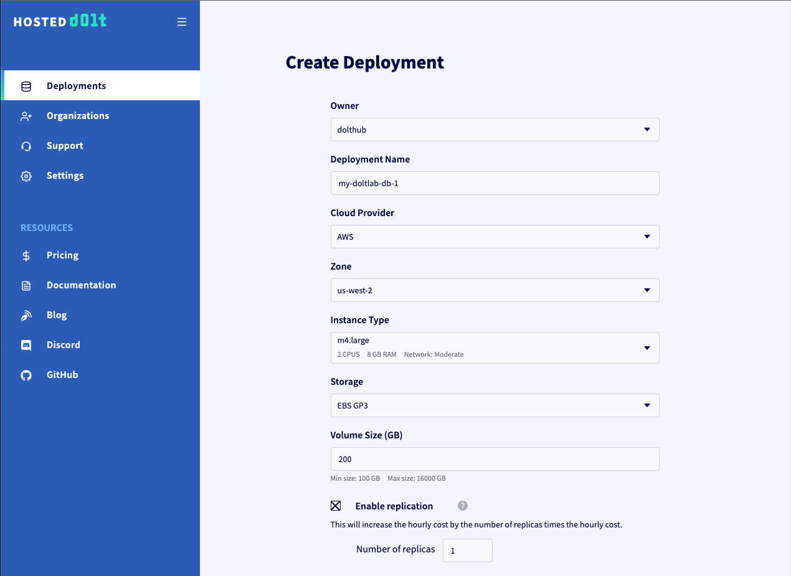

In the image above you can see that we defined our Hosted Dolt deployment name as `my-doltlab-db-1`, selected an AWS EC2 host with 2 CPU and 8 GB of RAM in region `us-west-2`. We've also requested 200 GB of disk. For DoltLab, these settings should be more than sufficient.

We have also requested a replica instance by checking the "Enable Replication" box, and specifying `1` replica, although replication is not required for DoltLab.

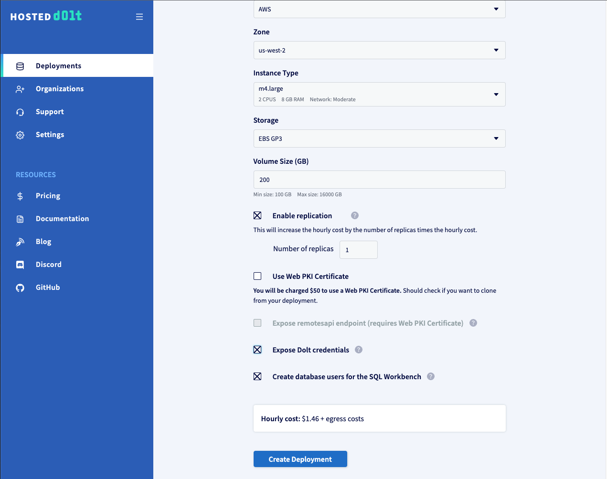

If you want the ability to [clone this Hosted Dolt instance](https://www.dolthub.com/blog/2023-04-17-cloning-a-hosted-database/), check the box "Enable Dolt Credentials". And finally, if you want to use the SQL workbench feature for this hosted instance (which we recommend) you should also check the box "Create database users for the SQL Workbench".

You will see the hourly cost of running the Hosted Dolt instance displayed above the "Create Deployment" button. Click it, and wait for the deployment to reach the "Started" state.

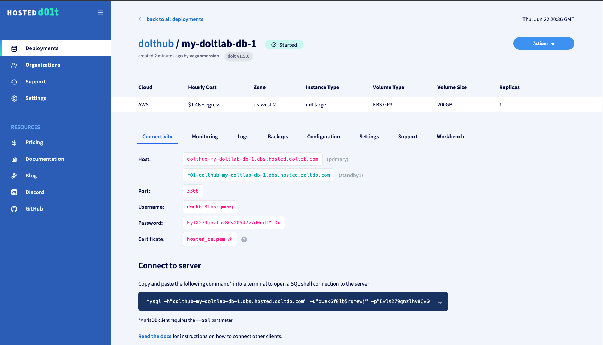

Once the deployment has come up, the deployment page will display the connection information for both the primary host and the replica, and each will be ready to use. Before connecting a DoltLab instance to the primary host, though, there are a few remaining steps to take to ensure the host has the proper state before connecting DoltLab.

First, click the "Configuration" tab and uncheck the box "behavior_disable_multistatements". DoltLab will need to execute multiple statements against this database when it starts up. You can also, optionally, change the log_level to "debug". This log level setting will make sure executed queries appear in the database logs, which is helpful for debugging.

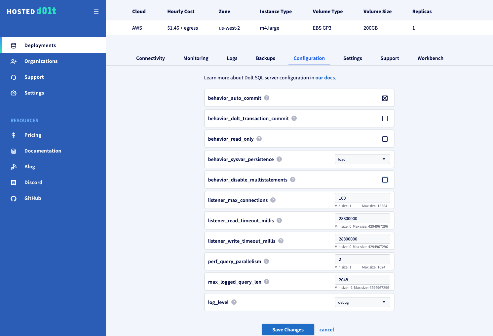

Click "Save Changes".

Next, navigate to the "Workbench" tab and check the box "Enable Writes". This will allow you to execute writes against this instance from the SQL workbench. Click "Update".

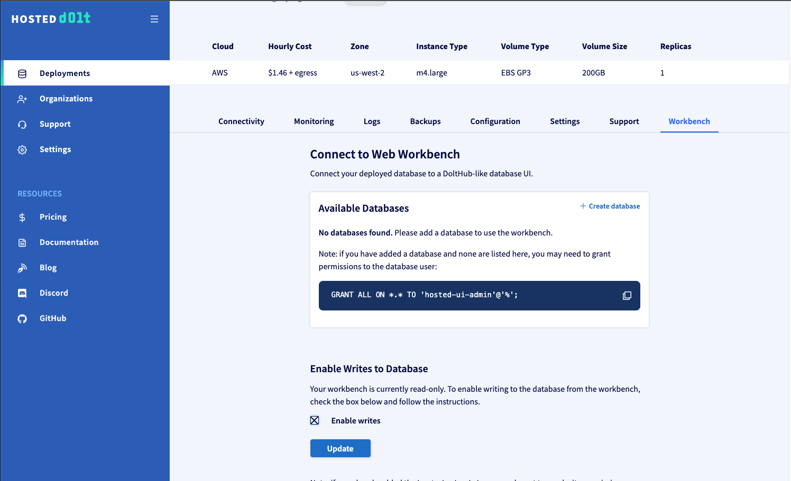

Then, with writes enabled, on this same page, click "Create database" to create the database that DoltLab expects, called `dolthubapi`.

Finally, create the required users and grants that DoltLab requires by connecting to this deployment and running the following statements:

```sql
CREATE USER 'dolthubadmin' IDENTIFIED BY '<password>';
CREATE USER 'dolthubapi' IDENTIFIED BY '<password>';
GRANT ALL ON *.* TO 'dolthubadmin';
GRANT ALL ON dolthubapi.* TO 'dolthubapi';
```

You can do this by running these statements from the Hosted workbench SQL console, or by connecting to the database using the mysql client connection command on the "Connectivity" tab, and executing these statements from the SQL shell.

This instance is now ready for a DoltLab connection.

## Rerun DoltLab's Installer

To connect DoltLab to `my-doltlab-db-1`, ensure that your DoltLab instance is stopped.

Next, edit the `services.doltlabdb.host`, `services.doltlabdb.port`, and `services.doltlabdb.tls_skip_verify` fields of the `installer_config.yaml`.

```yaml
# installer_config.yaml
services:
  doltlabdb:
    host: "dolthub-my-doltlab-db-1.dbs.hosted.doltdb.com"
    port: 3306
    tls_skip_verify: true
```

Save these changes and rerun the [installer](/reference/installer) to regenerate DoltLab assets that will use your hosted instance as DoltLab's application database.

```bash
./installer
```

Alternatively, rerun the [installer](/reference/installer) with `--doltlabdb-host` referring to the host name of the Hosted Dolt instance, `--doltlabdb-port` referring to the port, and `--doltlabdb-tls-skip-verify=true` if you'd prefer to use command line arguments.

```bash
./installer \
... \
--doltlabdb-host=dolthub-my-doltlab-db-1.dbs.hosted.doltdb.com \
--doltlabdb-port=3306 \
--doltlabdb-tls-skip-verify=true
```

Start DoltLab using the `./start.sh` script generated by the [installer](/reference/installer). Once DoltLab is running successfully against `my-doltlab-db-1`, you can create a database on DoltLab, for example called `test-db`, and you will see live changes to the database reflected in the Hosted Dolt workbench:

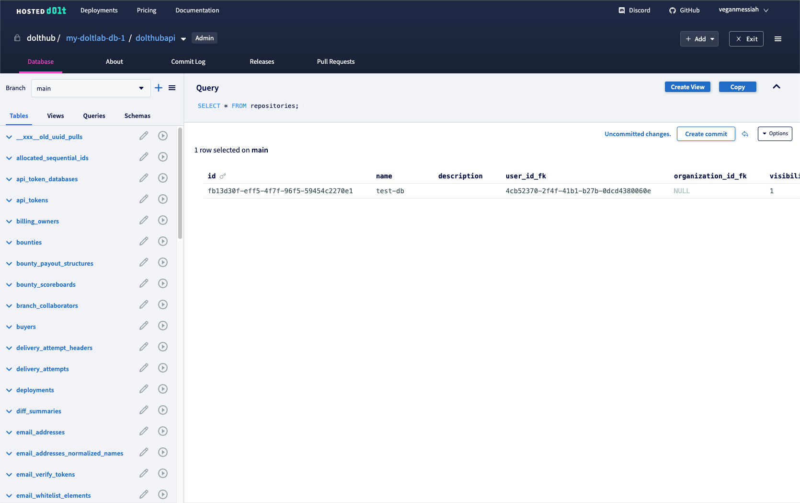

## Improve DoltLab performance

It is possible to limit the number of concurrent Jobs running on a DoltLab host, which might be starving the host for resources and affecting DoltLab's performance.

When users upload files on a DoltLab instance, or merge a pull request, DoltLab creates a Job corresponding to this work. These Jobs spawn new Docker containers that performs the required work.

By default, DoltLab imposes no limit to the number of concurrent Jobs that can be spawned. As a result, a DoltLab host might experience resources exhaustion as the Docker engine uses all available host resources for managing it's containers.

To limit concurrent Jobs, edit `./installer_config.yaml` to contain the following:

```yaml
# installer_config.yaml
jobs:
  concurrency_limit: 5
  concurrency_loop_seconds: 10
  max_retries: 5
```

Save these changes and rerun the [installer](/reference/installer) to regenerate DoltLab assets that will limit the Job concurrency of your instance.

```bash
./installer
```

Alternatively, you can use the following command line arguments with the [installer](/reference/installer) to prevent job resource exhaustion:

```bash
./installer \
...
--job-concurrency-limit="5" \
--job-concurrency-loop-seconds="10" \
--job-max-retries="5
```

## Serve DoltLab behind an AWS Network Load Balancer

The following section describes how to setup an [AWS Network Load Balancer (NLB)](https://aws.amazon.com/elasticloadbalancing/network-load-balancer/) for a DoltLab instance.

First, setup DoltLab on an [AWS EC2 host](https://aws.amazon.com/pm/ec2) in the same [Virtual Private Cloud (VPC)](https://docs.aws.amazon.com/vpc/latest/userguide/what-is-amazon-vpc.html) where your NLB will run.

If this instance should _only_ be accessible by the NLB, ensure that the DoltLab host is created in a private subnet and does not have public IP address.

After setting up your DoltLab host, edit the host's inbound security group rules to allow all traffic on ports: `80`, `100`, `4321`, `50051`, and `2001`.

Because the host is in a private subnet with no public IP though, only the NLB will be able to connect to the host on these ports.

Next, in AWS, create [target groups](https://docs.aws.amazon.com/elasticloadbalancing/latest/application/create-target-group.html) for each DoltLab port that the NLB will forward requests to. These ports are:
`80`, `100`, `4321`, and `50051`.

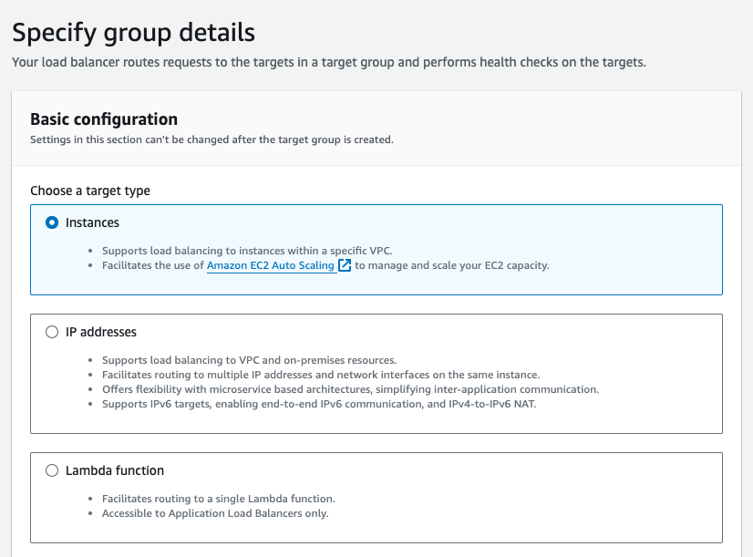

When creating the target groups, select `Instances` as the target type. Then, select `TCP` as the port protocol, followed by the port to use for the target group. In this example we will map all target group ports to their corresponding DoltLab port, ie `80:80`, `100:100`, `4321:4321` and `50051:50051`. Select the same VPC used by your DoltLab host as well.

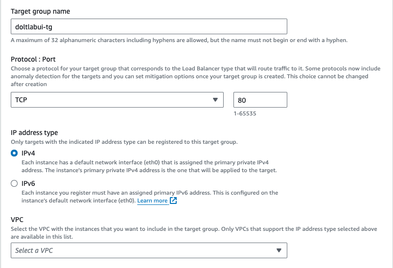

During target group creation, in the `Health Checks` section, click `Advanced health check settings` and select `Override` to specify the port to perform health checks on. Here, enter `2001`, the health check port for DoltLab's Envoy proxy, `doltlabenvoy`. We will use this same port for _all_ target group health checks.

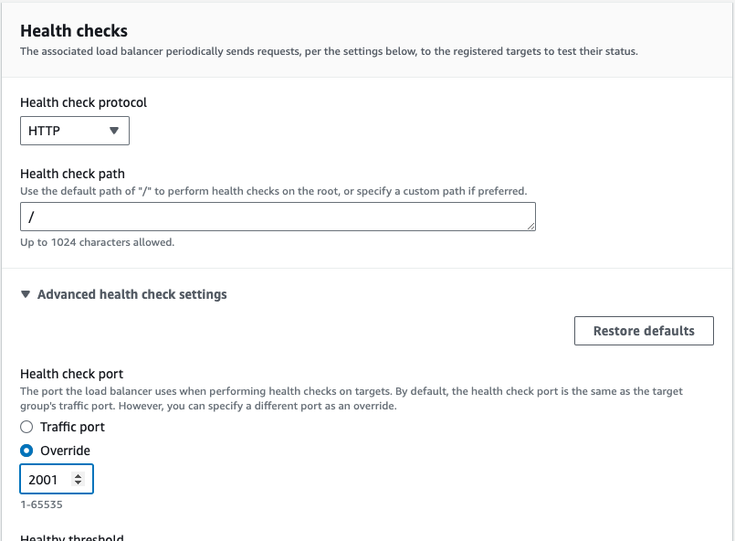

After clicking `Next`, you will register targets for your new target group. Here you should see your DoltLab host. Select it and specify the port the target group will forward to.

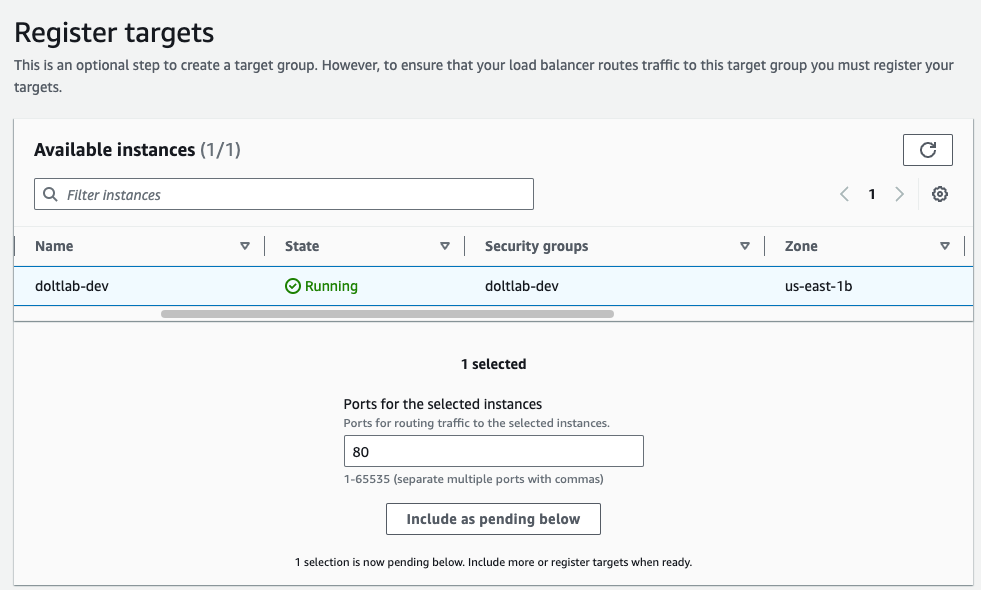

Click `Include as pending below`, then click `Create target group`.

Once you've created your target groups you can create the NLB.

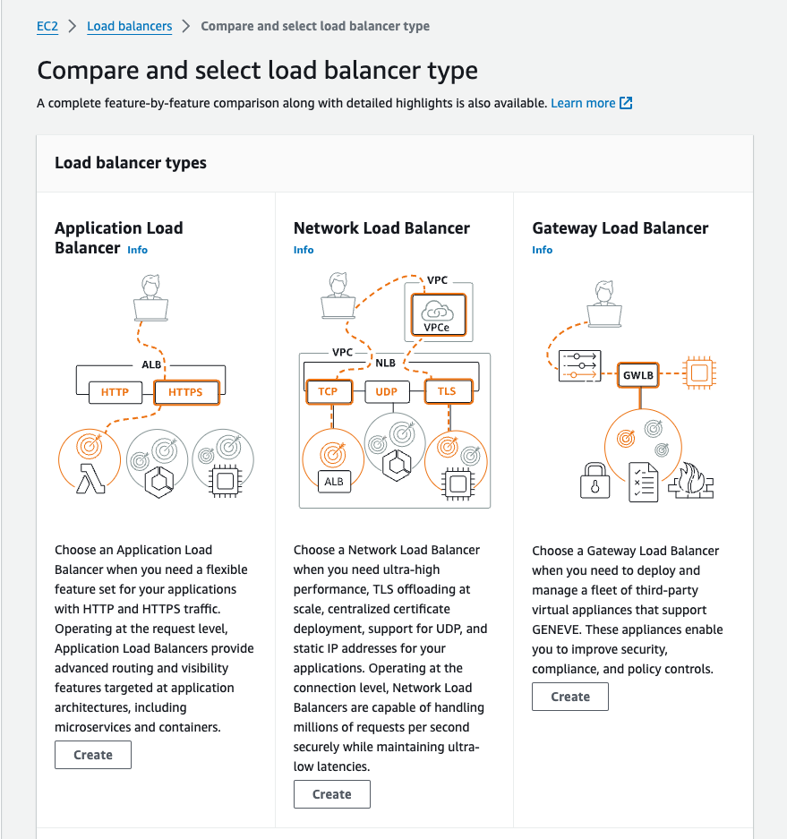

Be sure to select the Network Load balancer as the other types of load balancers may require different configurations.

Then, create an NLB in the same VPC and subnet as your DoltLab host that uses `Scheme: Internet-facing` and `Ip address type: IPV4`.

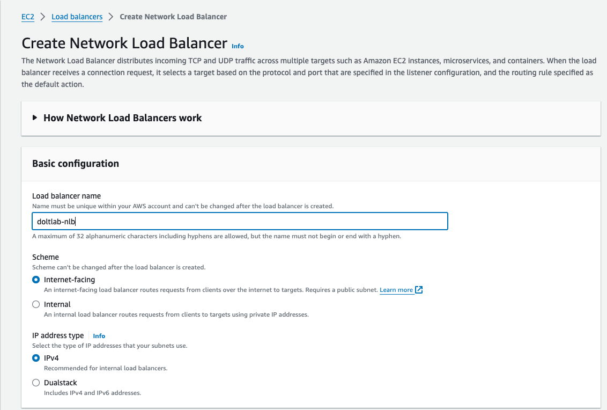

Additionally, select the the same availability zone that your DoltLab host uses. You can use the `default` security group for your NLB, however the ingress rules for this group will need to be updated before inbound traffic will be able to reach your NLB.

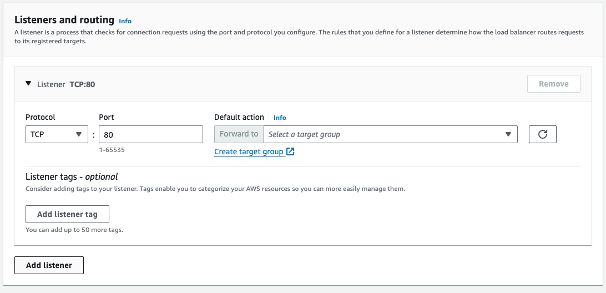

In the Listeners section, add listeners for each target group you created, specifying the NLB port to use for each one. But again, in this example we will forward on the same port. Click `Create load balancer`.

It make take a few minutes for the NLB to become ready. After it does, check each target group you created and ensure they are all healthy.

Next, edit the inbound rules for the security group attached to the NLB you created so that it allows connections on the listening ports.

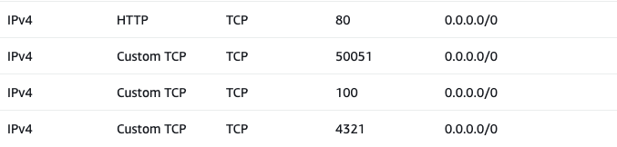

On the NLB page you should now see the DNS name of your NLB which can be used to connect to your DoltLab instance.

Restart your DoltLab instance supplying this DNS name as the `--host` to the [installer](/reference/installer), and your DoltLab instance will now be ready to run exclusively through the NLB.

## Update application database passwords

If DoltLab has never been started before on the host using the `start.sh` script, the passwords for its application database `doltlabdb` can be updated simply by editing their value in the `installer_config.yaml`, and then running the `installer`.

```yaml
# installer_config.yaml
services:
  doltlabdb:
    admin_password: "MySecurePassword1"
    dolthubapi_password: "MySecurePassword2"
```

```bash
# run the installer to regenerate DoltLab assets
./installer
```

If DoltLab _has_ been started before, then its application database has been initialized already, and has existing passwords for the SQL users `dolthubadmin` and `dolthubapi`. Changing the passwords in this instance requires DoltLab to be running, so that you can connect to the appliciation database `doltlabdb` with a SQL shell.

Ensure that DoltLab is running by executing the `./start.sh` script. Then, run `./doltlabdb/shell-db.sh` to open a SQL shell against `doltlabdb`. You will see a prompt like:

```bash
mysql>
```

Next, update the passwords for the users `dolthubadmin` and `dolthubapi` to the values of your choosing:

```bash
mysql> alter user dolthubadmin identified by 'NewPasswordHere';
mysql> alter user dolthubapi identified by 'NewPasswordHere';
```

Close the SQL shell, and stop DoltLab with `./stop.sh`.

Next, update `installer_config.yaml` to contain the new passwords you changed in the live database:

```yaml
# installer_config.yaml
services:
  doltlabdb:
    admin_password: "NewPasswordHere"
    dolthubapi_password: "NewPasswordHere"
```

Finally, rerun the `installer` to regenerate DoltLab's assets with the new password values.

```bash
./installer
```

Completing these steps ensures that the passwords are consistent on disk _and_ in the assets generated by the `installer`. You can now restart DoltLab.

## Run DoltLab with no egress access

Starting with DoltLab >= `v2.3.3`, DoltLab's service images are available [to download](https://github.com/dolthub/doltlab-issues/releases/tag/v2.3.3) and do not need to be pulled from their AWS ECR repositories. This is useful for when egress traffic is restricted on the DoltLab host.

To configure DoltLab to use these images without egress access, first, download the zip file containing the service images and upload them onto your DoltLab host.

Next, upload the corresponding DoltLab zip file to your DoltLab host as well. Both should be present on the host before continuing.

```bash
$ ls
doltlab-service-images-v2.3.3.zip  doltlab-v2.3.3.zip
```

First, unzip the DoltLab zip folder to a directory called `doltlab`, and `cd` into the directory.

```bash
$ unzip doltlab-v2.3.3.zip -d doltlab
Archive:  doltlab-v2.3.3.zip
  inflating: doltlab/smtp_connection_helper  
  inflating: doltlab/installer       
  inflating: doltlab/installer_config.yaml  
$ cd doltlab
$ ls
installer  installer_config.yaml  smtp_connection_helper
```

Next, edit [installer_config.yaml](/guides/installation/start-doltlab) with your desired configuration, or reuse a previous `installer_config.yaml`. If you are reusing an older config file, just update the `version` field at the top of the file to match the DoltLab version you're installing. Also, ensure any older DoltLab running on the host is shutdown by running the `./stop.sh` script.

Once your config file is updated, run the [installer](/reference/installer) binary to generate DoltLab's static assets.

```bash
$ ./installer
2024-09-23T17:58:44.898Z	INFO	metrics/emitter.go:111	Successfully sent DoltLab usage metrics

2024-09-23T17:58:44.898Z	INFO	cmd/main.go:554	Successfully configured DoltLab	{"version": "v2.3.3"}

2024-09-23T17:58:44.898Z	INFO	cmd/main.go:560	To start DoltLab, use:	{"script": "/home/ubuntu/doltlab/start.sh"}
2024-09-23T17:58:44.898Z	INFO	cmd/main.go:565	To stop DoltLab, use:	{"script": "/home/ubuntu/doltlab/stop.sh"}
```

After you've generated the static assets, it's time to load the service images. `cd` into the directory with the service images zip file. Unzip this file to a directory called `service-images`.

```bash
$ cd ../
$ unzip doltlab-service-images-v2.3.3.zip -d service-images
Archive:  doltlab-service-images-v2.3.3.zip
  inflating: service-images/doltremoteapi-server-v2.3.3.tar  
  inflating: service-images/dolthub-server-v2.3.3.tar  
  inflating: service-images/file-importer-v2.3.3.tar  
  inflating: service-images/dolt-sql-server-v2.3.3.tar  
  inflating: service-images/pull-merge-v2.3.3.tar  
  inflating: service-images/envoy-v1.28-latest.tar  
  inflating: service-images/dolthubapi-server-v2.3.3.tar  
  inflating: service-images/fileserviceapi-server-v2.3.3.tar  
  inflating: service-images/query-job-v2.3.3.tar  
  inflating: service-images/dolthubapi-graphql-server-v2.3.3.tar
$ cd service-images/
$ ls
dolt-sql-server-v2.3.3.tar  dolthubapi-graphql-server-v2.3.3.tar  doltremoteapi-server-v2.3.3.tar  file-importer-v2.3.3.tar          pull-merge-v2.3.3.tar
dolthub-server-v2.3.3.tar   dolthubapi-server-v2.3.3.tar
```

You will see tar files for each service DoltLab depends on. Load each of these tar files into Docker by using the [docker load](https://docs.docker.com/reference/cli/docker/image/load/) command.

```bash
$ docker load < dolt-sql-server-v2.3.3.tar
Loaded image: public.ecr.aws/dolthub/doltlab/dolt-sql-server:v2.3.3
$ docker load < dolthub-server-v2.3.3.tar
docker load < dolthubapi-graphql-server-v2.3.3.tarLoaded image: public.ecr.aws/dolthub/doltlab/dolthub-server:v2.3.3
$ docker load < dolthubapi-graphql-server-v2.3.3.tar
Loaded image: public.ecr.aws/dolthub/doltlab/dolthubapi-graphql-server:v2.3.3
$ docker load < dolthubapi-server-v2.3.3.tar
Loaded image: public.ecr.aws/dolthub/doltlab/dolthubapi-server:v2.3.3
$ docker load < doltremoteapi-server-v2.3.3.tar
Loaded image: public.ecr.aws/dolthub/doltlab/doltremoteapi-server:v2.3.3
$ docker load < envoy-v1.28-latest.tar
Loaded image: envoyproxy/envoy:v1.28-latest
$ docker load < file-importer-v2.3.3.tar
Loaded image: public.ecr.aws/dolthub/doltlab/file-importer:v2.3.3
$ docker load < fileserviceapi-server-v2.3.3.tar
Loaded image: public.ecr.aws/dolthub/doltlab/fileserviceapi-server:v2.3.3
$ docker load < pull-merge-v2.3.3.tar
Loaded image: public.ecr.aws/dolthub/doltlab/pull-merge:v2.3.3
$ docker load < query-job-v2.3.3.tar
Loaded image: public.ecr.aws/dolthub/doltlab/query-job:v2.3.3
```

This will load the required service images into Docker and they are immediately ready for DoltLab to use. Be sure to load _ALL_ images contained within `service-images`, as failing to do so will cause DoltLab to not work correctly.

You can now return to the `doltlab` directory and start your DoltLab instance.

```bash
$ cd ../doltlab
$ ./start.sh
```

## Reset a user's password

As of [DoltLab v2.2.0](https://www.dolthub.com/blog/2024-07-11-announcing-doltlab-v220/), if a user of your DoltLab instance has forgotten their password, the DoltLab admin must reset that user's password on their behalf.

To do so, using the default user `admin` account on your DoltLab instance, navigate to Profile > Settings > Reset user passwords.

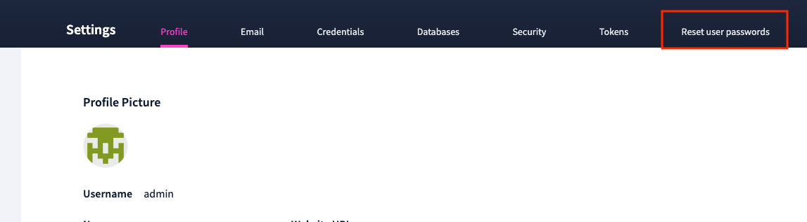

After completing the form, the selected user will be able to login with their new password.

Starting with DoltLab >= v2.3.7, resetting a user's password will also reset the user's password attempts. If you're instance is < v2.3.7, follow the steps in the next section to reset the user's password attempts also, if this too is required.

## Reset password attempts for a user

In the event a user has exceeded the maximumum number of password attempts, 3, the DoltLab admin can reset the user's password attempts by using the `doltlabdb/shell-db.sh` script.

Once connected to the database, run the following SQL statements to reset the user's password attempts:

```sql
-- first get the user's id
SELECT * FROM users WHERE name = 'username';

-- then reset the user's password attempts
DELETE FROM password_attempts WHERE user_id_fk = 'user_id';
```

This will reset the user's password attempts to 0 and allow them to attempt to login again.

## Change doltlabdb Server Configuration

In DoltLab >= v2.3.12, the unused `doltlabdb-dolt-configs` volume has been removed, in favor of explicitly generating and mounting a [config.yaml](https://docs.dolthub.com/sql-reference/server/configuration#config.yaml) file used to configure the `doltlabdb` application server.

This config file will be generated by the `installer` and mounted to the `doltlabdb` container at runtime. This allows for more visibility into how the `doltlabdb` server is configured, and allows DoltLab admins to modify server settings more easily.

When the `installer` runs, it will generate a new Dolt server configuration file to `doltlabdb/config.yaml`. This generated file, can be edited by hand in a pinch, but we recommend using the `installer_config.yaml` to specify the server configuration option(s) you want, then rerunning the `installer` to generate a new `doltlabdb/config.yaml` that reflects that change(s). Any manual edits to this file will be overwritten the next time the `installer` is run.

Alternatively, a custom `config.yaml` file can be supplied to the [server_config](/reference/installer/configuration-file#server_config) field in the `installer_config.yaml` file. If this is supplied, it will take precedence and the installer will not generate its own `config.yaml`. All settings for `doltlabdb` will need to be defined in this file.

## Troubleshoot common issues

## DoltLab UI displaying an error after starting the instance

If you started your DoltLab instance, but the UI is displaying an error, it is often the case that `doltlabapi` has crashed during startup. To verify that this, check the logs for `doltlabapi` by running:.

```bash
docker logs doltlab_doltlabapi_1
```

If you see an error similar to `could not open database connection`, this means that `doltlabapi` was unable to connect to the application database `doltlabdb`.

To troubleshoot this issue, check that the `doltlabdb` container is running by running:

```bash
docker ps
```

If you do not see the `doltlabdb` container running, then it too has crashed on startup. Investigate the logs for the `doltlabdb` container by running:

```bash
docker logs doltlab_doltlabdb_1
```

If the `doltlabdb` container is running, it is likely that case that the current database connection credentials used by `doltlabapi` are not the same as those used by the `doltlabdb` container.

It is important to remember that the first time a DoltLab instance is started, the `doltlabdb` container is initialized with `admin_password` and `dolthubapi_password` values from the `installer_config.yaml` file. These values are persisted to disk, and will be expected for all successful database connections.

If you have changed the database passwords in `installer_config.yaml` after the initial startup, you will need either:

- Connect to the `doltlabdb` [container and update the credentials manually](#update-application-database-passwords).
- Delete the persistent Docker volume storing the `doltlabdb` container's data. To do this, make sure your DoltLab instance is stopped, then run:

```bash
docker volume rm doltlab_doltlabdb-dolt-data
```

After deleting the volume, start your DoltLab instance again. DoltLab will recreate the volume and it will be initialized with the new credentials you provided in `installer_config.yaml`.

For all other issues not covered in this section, please reach out to our support team on [Discord](https://discord.gg/dolthub).

## Run DoltLab with Podman

To run DoltLab with Podman (rootless), do the following:

1. Select the Podman runtime when generating assets with the [installer](/reference/installer):

   - Pass the `--runtime=podman` flag, or 
   - Set `runtime: podman` in `installer_config.yaml` and rerun `./installer`.

   When Podman mode is enabled, use `podman`/`podman-compose` in place of `docker`/`docker-compose`. Container names may use hyphens instead of underscores (e.g., `doltlab-doltlabapi-1`).

2. Install Podman and Podman Compose.

   - If you are using the generated install scripts, these will be installed for you automatically.
   - Otherwise, install them via your distro's package manager. Examples:

   ```bash
   # Debian / Ubuntu
   sudo apt update && sudo apt install -y podman podman-compose

   # Fedora
   sudo dnf install -y podman podman-compose

   # Arch Linux
   sudo pacman -S --needed podman podman-compose
   ```

3. Allow rootless containers to bind to port 80 by lowering the unprivileged port start. Add the following to `/etc/sysctl.conf`:

   ```
   net.ipv4.ip_unprivileged_port_start=80
   ```

   Then apply the change:

   ```bash
   sudo sysctl -p
   ```

   You may also need to restart the host.

4. Start the Podman REST API so Docker-compatible clients can connect (use a background process or systemd):

   ```bash
   podman system service -t 0 &
   ```

   If your environment expects a Docker socket, you may also need to export `DOCKER_HOST` to point at Podman's socket (for example, `unix:///run/user/$UID/podman/podman.sock`).

5. Start DoltLab as usual with the generated scripts:

   ```bash
   ./start.sh
   ```

With these steps, DoltLab should run under Podman without requiring root privileges.
